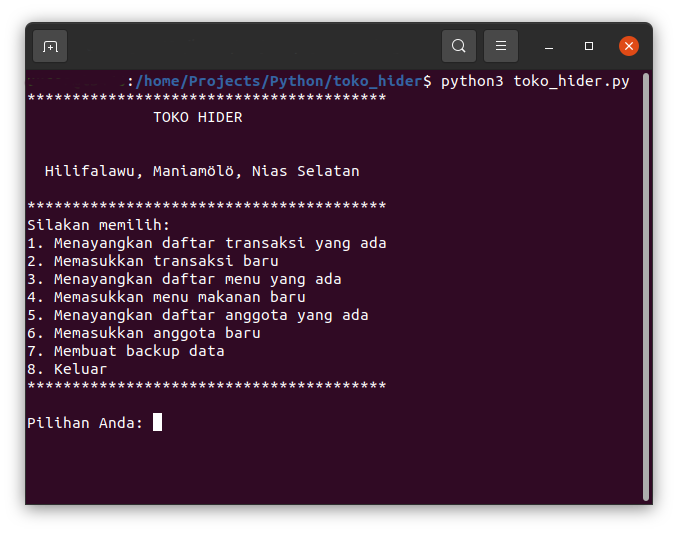

# toko_hider

Aplikasi toko berbasis database sebagai bahan latihan belajar python.

Saat ini terdapat tiga tabel dalam database ini, yakni daftar menu, daftar anggota dan daftar transaksi.

Ada menu pilihan:
1. Menampilkan transaksi yang ada
2. Memasukkan transaksi baru
3. Menampilkan menu yang ada
4. Memasukkan menu makanan baru
5. Menampilkan anggota yang ada
6. Memasukkan anggota baru
7. Membuat backup data 
8. Keluar




## Bagaimana mulai

Klon repositori ini ke komputer Anda lalu jalankan aplikasi dengan perintah
```
python3 toko_hider.py
```


## Catatan

Database utama toko ada dalam berkas `toko_hider.json`. Berbagai data menu, anggota dan transaksi ada dalam daftar sementara `toko_anggota.json` dengan key "anggota", `toko_menu.json` dengan key "menu" dan `toko_transaksi.json` dengan key "transaksi".

Pada saat proses backup, data dari berbagai daftar sementara akan disimpan ke dalam database.

Ya'ahowu.

